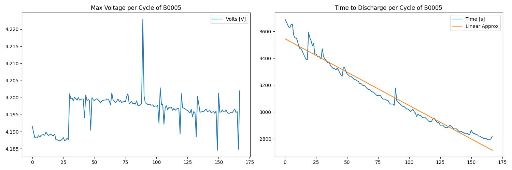

# Analyzing Lithium-Ion Batteries to Understand The Lifespan and Degradation of Batteries Over Time

The goal of this project is to better understand the degradation of batteries and their life cycles through an online database. 
The data we used can be found here: https://www.kaggle.com/datasets/patrickfleith/nasa-battery-dataset/data

The database is broken up into different batteries and three test types: Discharge, Charge, and Impedance.
Within this project, we analyzed the Discharge and Charge tests to better answer our guiding questions.

## 0 Dependencies
The code was written on Windows based systems, but should operate properly on Mac systems.
File names may need to be changed to correctly work on Mac

Four main Python packages are used: Numpy, MatPlotLib, Pandas, and SciPy.
Numpy and SciPy are used for mathematical operations, Pandas for data frame structures, and MatPlotLib for displaying results.

## 1 Main Programs
### 1.1 BDA (Battery Data Analysis)
The BDA functions as a way to both plot our data and analyze trends across all datasets.
Each battery has many different test results that are interpreted through the BDA.
For every battery, two plots are generated.
One shows the max discharge voltage of the batter across many different cycles.
The other shows the total battery discharge time across many different cycles.
These charts help to answer our questions about the battery conditions and how quickly they degrade based on those conditions.
See the chart below for a one result for a given battery:

### 1.2 Discharge Power Lifespan
The Discharge Power Lifespan works through our chosen datasets and determines the degradation values.
An average battery life, average time reduction per cycle, and percent reduction values are produced for each test case.
For now, there are 5 different test cases that were analyzed, with more potentially in the future.

### 1.3 Import MetaData
Here, the provided metadata from the dataset was analyzed to find the unique batteries we would later sort through.
This function will create a directory within the project for each of the battery types.
However, the specific tests and data associated with those batteries will be later derived in another function.

### 1.4 Rate of Voltage Drop
For each battery, the voltage drop during a discharge test was plotted to be analyzed.
Our purposes looked at the behaviour of the voltage, wondering whether it is a linear or exponential relationship.
This function will generate voltage vs. time charts for each battery and all of their unique discharge tests.
These plots will then be saved and can be found within this repository.

### 1.5 Sort Data by Type
From the given metadata and the directories created in Import MetaData, all of the battery data was sorted into three types: Discharge, Charge, and Impedance.
This function works through all provided datasets and sorts them based on the provided metadata file.
Once within the proper directory, this function does not need to be executed again.

## 2 Operation of Code
For first time operators, you will first need to download the data from the online database provided above.
Next, you will need to run the Import MetaData function with the downloaded data.
Make sure the file path naming convention works for your device.
After Import MetaData has been executed successfully, use Sort Data by Type to clean up the data into a readable format.

One sorted analysis can begin. Any of the other three scripts can be run to generate charts and results.
BDA and Rate of Voltage Drop will generate plots and save them within your project.
If you wish not to save them, remove the same line within each.
Discharge Power Lifespan outputs a print statement, nothing needed to be done here.

## 3 Results
From the testing, three different types of results were generated.
First, the BDA generated a plot similar to the one below for all of the batteries:

*BDA Plot*

From the Discharge Power Lifespan, the following results were generated:

*DPL results*

Finally, from the Rate of Voltage Drop, a unique plot was created for each discharge test for every battery.
These charts helped to visualize how the voltage changes during a discharge test and whether they are linear or exponential.

*ROVD Plot*

## 4 Limitations
These functions are relatively limited as they focus on setting up the data for being processed and then producing plots that can be analyzed.
For our purposes, these functions provided clear information about battery performance and life cycle expectancies. 
A limitation of this project is the failure to use the impedance data as it does not pertain directly to the questions we posed at the beginning of the project.

## 5 Future Results
This project has been a good starting point for future battery lifespan analysis. 
Each of the datasets has been analyzed for their central properties, but has not gone beyond that.
In the future, work would be focused on understanding what relationship between the various parameters in the datasets have with each other.
As our project focused solely on one at a time, discharge or charge, crossing over to analyze both would be beneficial for overall performance of the batteries.
Finally, impedance would help to better understand the batteries abilities and how the discharge and charge rates may correlate with their expected life spans.

